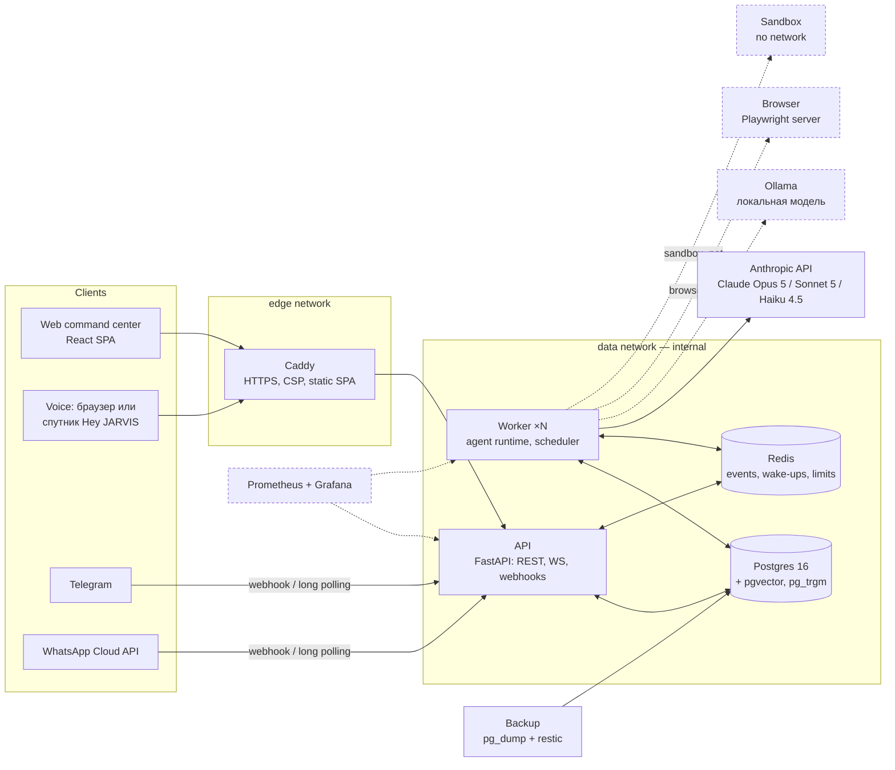
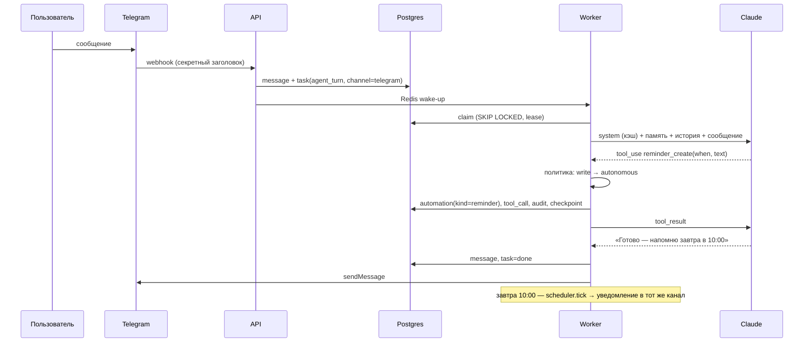
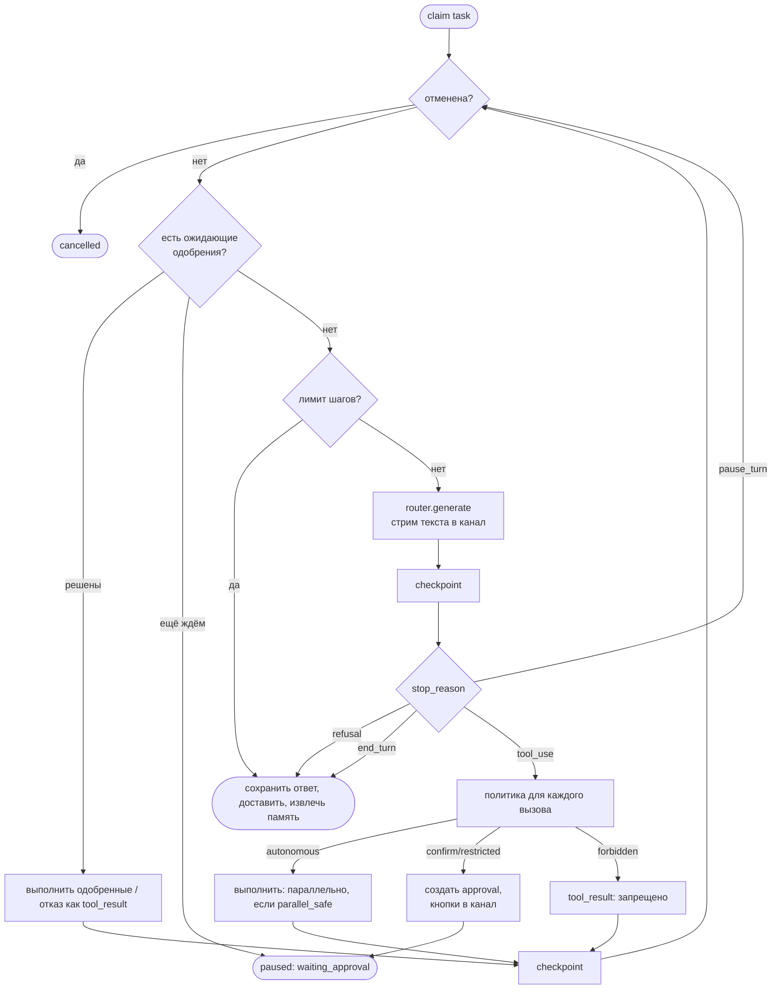

# Архитектура JARVIS

## A. Итоговая архитектура

Один сервер (VPS 4 vCPU / 8 ГБ, без GPU), `docker compose`, работает 24/7. Опционально — домашний
ПК/мини-ПК с GPU для локальной модели, подключаемый через Tailscale, и голосовые спутники с wake word.



**Принципы**

1. **Одно ядро на все каналы.** Любое входящее сообщение (web, голос, Telegram, WhatsApp) превращается
   в одну и ту же сущность — задачу `agent_turn` в Postgres. Каналы — тонкие адаптеры: доставить ответ,
   показать кнопки одобрения, распознать/синтезировать речь.
2. **Долговечность прежде всего.** Состояние агента сохраняется после каждого шага (`tasks.state`).
   Перезапуск контейнера, падение модели или ожидание подтверждения не теряют работу: задача
   продолжится с последнего чекпойнта.
3. **Минимум компонентов.** Postgres — и данные, и очередь (SKIP LOCKED), и векторный поиск, и
   полнотекстовый поиск. Redis — только эфемерное: шина событий, сигнал «есть работа», лимиты, флаги
   отмены. Нет Kafka/Celery/отдельной векторной БД.
4. **API не думает.** API принимает запросы и отдаёт события; всё, что зовёт модель или инструменты,
   выполняет worker. Воркеры масштабируются горизонтально (`docker compose up -d --scale worker=3`).
5. **Изоляция опасного.** Браузер и песочница кода — отдельные контейнеры в отдельных сетях. Песочница
   без интернета и без доступа к БД.

**Поток одного запроса** («JARVIS, напомни мне завтра в 10 купить молоко» в Telegram):



## B. Технологический стек

| Слой | Выбор | Почему |
|---|---|---|
| Основная модель | **Claude Opus 5** (`claude-opus-5`), adaptive thinking, effort по маршруту | сильнейший агентный tool use, 1M контекст, серверный web search/fetch |
| Суб-агенты | Claude Sonnet 5 | чтение/исследование дешевле при высоком качестве |
| Память, классификация | Claude Haiku 4.5 + structured output | быстро и дёшево, строгий JSON |
| Резервная/приватная модель | любой OpenAI-совместимый сервер (Ollama, vLLM) | работа при недоступности API, приватные задачи |
| Backend | Python 3.12, FastAPI, SQLAlchemy 2 async, asyncpg, Alembic, Pydantic 2 | зрелая async-экосистема, SDK Anthropic и MCP |
| БД | PostgreSQL 16 + pgvector + pg_trgm | одна БД для данных, очереди, векторов и FTS |
| Эфемерное | Redis 7 | pub/sub событий, BLPOP-пробуждение воркеров, rate limit |
| Эмбеддинги | локально: `paraphrase-multilingual-MiniLM-L12-v2` (fastembed/ONNX, CPU) | приватно, без ключа, русский+английский; можно Voyage/OpenAI |
| Инструменты | собственный реестр + **MCP** (официальный Python SDK) | нативные инструменты + любые MCP-серверы через тот же шлюз разрешений |
| Браузер | Playwright server (отдельный контейнер) | реальный Chromium, изолирован от данных |
| STT / TTS | Deepgram nova-3 (multi) / ElevenLabs Flash v2.5; резерв — OpenAI; без ключей — Web Speech API браузера | низкая задержка, русский язык, стриминг |
| VAD / wake word | Silero VAD v5 в браузере (@ricky0123/vad-web); openWakeWord `hey_jarvis` на спутнике | работают локально, без облака и без LLM |
| Frontend | React 19, Vite, TypeScript, Tailwind 4, TanStack Query, zustand | быстрый SPA, живые события через WebSocket |
| Edge | Caddy 2 | автоматический HTTPS, заголовки безопасности, раздача SPA |
| Наблюдаемость | structlog (JSON), Prometheus, Grafana, собственные журналы LLM/инструментов/аудита в БД | стоимость, задержки, ошибки — и в UI, и в Grafana |
| Бэкапы | pg_dump + restic (шифрование, дедупликация, S3/B2/локально) | проверяемые, ротация 7/4/12 |

## C. Инфраструктура

| Контейнер | Сети | Назначение |
|---|---|---|
| `caddy` | edge | единственная точка входа: 80/443, HTTPS, CSP, SPA, `/api/*` → api |
| `api` | edge, data, egress | REST, WebSocket (`/api/ws`, `/api/ws/voice`), вебхуки; `jarvis migrate` при старте |
| `worker` | data, egress, browser_net, sandbox_net | агентный цикл, планировщик, обслуживание; метрики на :9100 |
| `postgres` | data (internal) | pgvector/pgvector:pg16 |
| `redis` | data (internal) | AOF, без внешнего доступа |
| `backup` | data, egress | ночной pg_dump + restic snapshot `/data`; проверка репозитория по воскресеньям |
| `browser` *(profile)* | browser_net | Playwright run-server |
| `sandbox` *(profile)* | sandbox_net (internal) | исполнение Python/shell: read-only FS, uid 20001, `cap_drop: ALL`, лимиты CPU/RAM/PIDs, без DNS и интернета |
| `prometheus`, `grafana` *(profile monitoring)* | data (+egress для Grafana) | Grafana только на 127.0.0.1:3001 |
| `ollama` *(profile local-ai)* | data, egress | локальные модели |
| `restore` *(profile restore)* | data | разовое восстановление с записью в data-том |

Тома: `pgdata`, `redisdata`, `jarvis_data` (файлы пользователя, ключи шифрования, кэш моделей),
`caddy_data` (сертификаты), `sandbox_workspace`. Секреты — в `.env` (генерирует `setup.sh`) и
зашифрованно в БД (ключи, введённые через UI). Логи — JSON в stdout с ротацией Docker (10 МБ × 5).

## D. Агентное ядро

### Модули

```
backend/jarvis/
├── agent/        harness.py (AgentRuntime), context.py (сборка контекста), profiles.py (оркестратор и суб-агенты), identity.py
├── llm/          router.py (маршруты, фолбэки, бюджет), anthropic_provider.py, openai_compat.py, pricing.py, fake.py
├── tools/        base.py (@tool, Risk, ToolContext), registry.py, executor.py (валидация, таймауты, ретраи), mcp.py, builtin/
├── permissions/  policy.py (решение о тире), approvals.py (запрос/решение/возобновление)
├── memory/       store.py (гибридный поиск), extraction.py (извлечение + согласование), embeddings.py
├── tasks/        engine.py (очередь), scheduler.py (напоминания и автоматизации), worker.py
├── skills/       manager.py (обнаружение, включение, триггеры)
├── channels/     hub.py (доставка), telegram.py, whatsapp.py, pairing.py
├── voice/        service.py (STT/TTS), session.py (голосовая сессия, barge-in)
├── integrations/ google/ (OAuth, Calendar, Gmail, Drive), web.py, browser.py, sandbox.py, files.py
├── core/         container.py (AppContext), events.py, audit.py, secrets.py, metrics.py, logging.py
├── security/     crypto.py (MultiFernet), passwords.py (argon2id), ssrf.py, ratelimit.py
└── api/          app.py, deps.py (сессии, CSRF, скоупы), routes/
```

### Цикл агента (`AgentRuntime._loop`)



* **Шаги и чекпойнты.** После каждого ответа модели и после каждой пачки результатов инструментов
  `tasks.state` (сообщения, счётчик шагов, трасса, флаг taint) сохраняется. Воркер держит lease с
  heartbeat; если воркер умер, другой заберёт задачу после истечения lease и продолжит с чекпойнта.
* **Идемпотентность.** Каждый вызов инструмента записывается в `tool_calls` с уникальным `tool_use_id`
  до выполнения. При повторе задачи уже выполненный вызов не повторяется — берётся сохранённый результат.
  Автоматические ретраи — только у идемпотентных инструментов (по умолчанию все read); инструменты с
  побочными эффектами не повторяются, а параллельно выполняются только read-инструменты.
* **Ошибки.** Таймаут на каждый инструмент; ошибки инструмента возвращаются модели как `is_error`
  (она может исправиться); ретраибельные ошибки модели (429/5xx/overloaded) → задача повторяется с
  экспоненциальной задержкой, максимум `max_attempts` (по умолчанию 3), без бесконечных циклов;
  фолбэк на `local`-маршрут, если он настроен. Неретраибельные → понятное сообщение «⚠️ …».
* **Бюджет.** Перед каждым вызовом роутер сверяет траты за сутки с `JARVIS_DAILY_COST_LIMIT_USD`.
* **Отмена.** «Стоп»/«отмена» в любом канале, кнопка в UI или `task_cancel`: флаг в Redis + БД,
  наблюдатель в воркере прерывает текущий вызов, дочерние задачи отменяются каскадно.
* **Статусы без «мыслей».** В канал уходят только безопасные события: `agent.status` («Думаю…»,
  «Ищу в интернете…» — текст задаётся полем `activity` инструмента), `tool.started/finished`
  (имя + краткий итог), `message.delta` (сам ответ), `approval.requested`. Блоки thinking модели
  никогда не отправляются пользователю.
* **Суб-агенты.** `agent_delegate` запускает research / browser / coding / planner с собственным
  промптом, дешёвым маршрутом `worker`, урезанным набором инструментов (только autonomous-уровня,
  в основном чтение) и лимитом шагов. Результат возвращается оркестратору как данные. Используются,
  только когда работа параллелится или загрязняет контекст (много страниц, длинный код).
* **Фоновые задачи.** `task_spawn_background` — длинная работа (отчёт, исследование) идёт отдельной
  задачей; пользователь получает уведомление по завершении в том канале, откуда пришла просьба.

### Контекст (`ContextAssembler`)

1. **System, блок 1 (кэшируется):** identity + personality + operating rules + сводка разрешений +
   правила памяти + индекс навыков (название и описание каждого включённого навыка).
2. **System, блок 2:** профиль пользователя (`config/identity/user.md`), «ядро» памяти (закреплённое,
   важное, профиль), краткое содержание длинной беседы.
3. **История:** последние сообщения основной беседы; прошлые вызовы инструментов воспроизводятся
   компактными парами tool_use/tool_result.
4. **Текущее сообщение + `<context>`:** текущее время и часовой пояс, канал и стиль ответа (голос —
   коротко, без Markdown), найденные по смыслу воспоминания, подсказки навыков по триггерам,
   ожидающие одобрения, фоновые задачи.

Навыки загружаются лениво: в system только индекс, полные инструкции — через `skill_load` или
автоматически при совпадении триггера.

### Память

| Тип (`kind`) | Что хранит | Пример |
|---|---|---|
| `profile` | факты о пользователе | «Живёт в Киеве, работает продакт-менеджером» |
| `relationship` | люди | «Анна — сестра, живёт в Берлине» |
| `project` | проекты и контекст работы | «JARVIS: личный ассистент на своём сервере» |
| `episodic` | события и договорённости | «27.09 обсуждали переезд на новый VPS» |
| `semantic` | прочие знания | «Любимый формат отчётов — короткий, с выводами в начале» |
| `important` | критичное | «Аллергия на арахис» — всегда в контексте |

Кратковременная память — история беседы; рабочая — `tasks.state` текущей задачи.

**Запись.** Явно (`memory_remember`, «запомни…») или автоматически: после каждого ответа
фоновая задача `memory_extract` просит Haiku извлечь долговременные факты (structured output), затем
для каждого находит похожие и решает: add / update / supersede (старое помечается `superseded`) / skip.
Дедупликация по косинусной близости ≥ 0.92. Всё редактируется и удаляется в UI (страница «Память»),
экспорт/импорт JSON.

**Поиск.** Гибридный: pgvector (смысл) + Postgres FTS с русской и английской морфологией (формы слов) +
pg_trgm (опечатки), слияние Reciprocal Rank Fusion, затем поправки на важность, свежесть и закрепление.
Если модель эмбеддингов недоступна, автоматический предохранитель переводит память на FTS+триграммы
без задержек, повторная попытка через 30 минут.

### Разрешения (HITL)

| Tier | Поведение | По умолчанию для |
|---|---|---|
| **autonomous** | выполняется сразу | read, write (память, напоминания, свой календарь, файлы) |
| **confirm** | «Я готов выполнить действие. Подтвердить?» — кнопки в web/Telegram/WhatsApp, «да/нет» голосом | external (отправка почты, внешние API), удаление событий и файлов, код в песочнице, автоматизации |
| **restricted** | только в веб-приложении и только после повторной аутентификации (пароль/TOTP, 10 минут) | high (финансы, безопасность, разрушительное) |
| **forbidden** | инструмент не показывается модели вообще | `payments_*`, `*_purchase` и т.п. |

Порядок решения: запрещённые шаблоны → правила пользователя из UI (по инструменту, навыку или уровню
риска) → `permissions.yaml` → уровень риска → **taint**: после того как в задачу попал недоверенный
контент (веб-страница, письмо, файл, ответ MCP), любые write-инструменты тоже требуют подтверждения —
prompt injection не сможет тихо записать память или создать автоматизацию. У каждого канала есть
потолок: из Telegram/WhatsApp/голоса нельзя одобрить restricted-действие. Ослабить правило в UI можно
только в режиме повышенных прав; high-risk нельзя сделать autonomous.

### Задачи, планировщик, автоматизации

* Очередь — таблица `tasks`: `SELECT … FOR UPDATE SKIP LOCKED`, приоритет, `run_after`, lease + heartbeat,
  ретраи с экспоненциальной задержкой, статусы `queued → running → (waiting_approval) → done | failed | cancelled`.
* Планировщик (в каждом воркере, конкурентно-безопасно через SKIP LOCKED) каждые 10 секунд
  выбирает созревшие `automations`: `reminder` доставляется как уведомление без вызова модели,
  `agent` создаёт задачу с промптом («каждую пятницу в 18:00 пришли обзор недели»). Расписание — cron
  в часовом поясе пользователя (`croniter`), интервал (не чаще раза в 5 минут) или одноразовое время.
* Обслуживание: истечение просроченных одобрений, удаление воспоминаний с истёкшим `expires_at`, очистка старых событий задач.

### Каналы

| Канал | Вход | Одобрения | Особенности |
|---|---|---|---|
| Web | WebSocket `/api/ws` + REST | карточки в чате и панели | живые статусы, стрим ответа, загрузка файлов |
| Голос | WebSocket `/api/ws/voice` (браузер или спутник) | «да»/«нет» голосом | VAD в браузере, STT → агент → TTS по предложениям, barge-in |
| Telegram | webhook или long polling | inline-кнопки | привязка кодом из UI (`/start 123456`), голосовые сообщения |
| WhatsApp | Cloud API webhook (HMAC) | interactive buttons | привязка «link 123456», аудиосообщения |

Все каналы используют одну основную беседу пользователя, поэтому контекст общий: начали в Telegram —
продолжили голосом дома.
